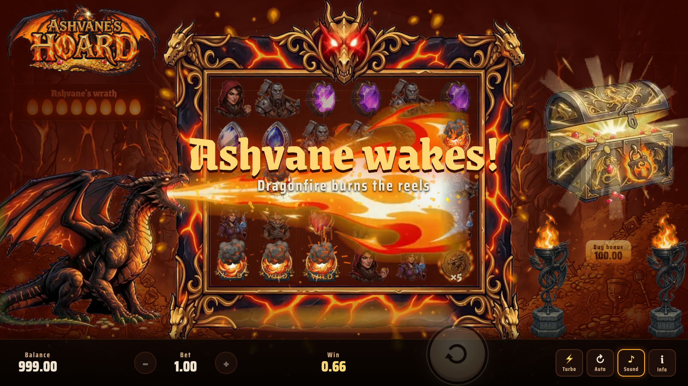
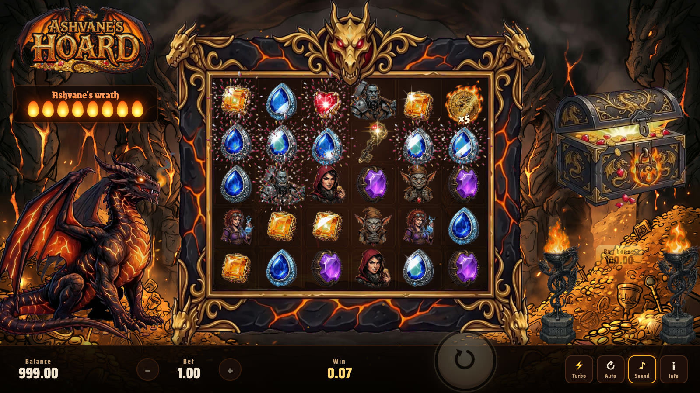
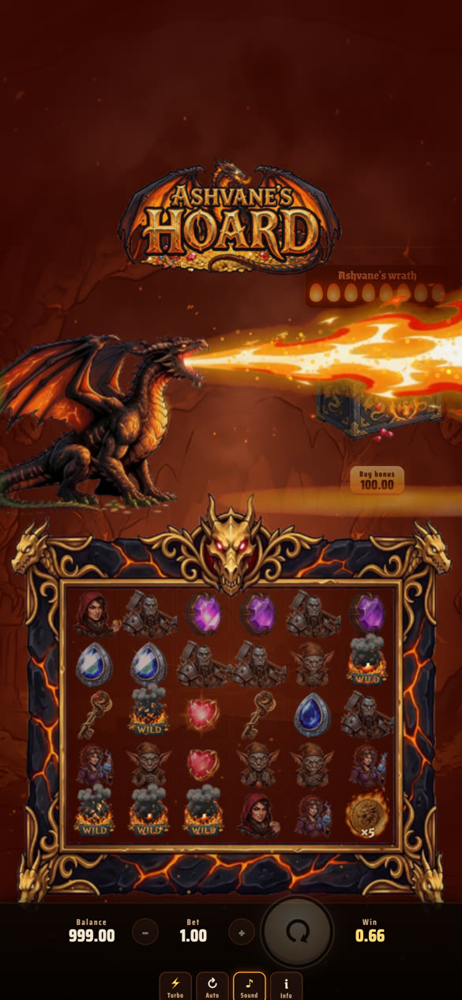

# Ashvane's Hoard

**A dragon-heist slot where everything that moves is a transparent video.** The dragon, its fire breath, the
animated lava frame, every symbol, the treasure chest, the braziers, the logo and every burst, shatter, flame
pillar and coin eruption are AI-generated video clips, keyed and packed into `.opal` files by
Opal and played by [`opal-sprites`](https://www.npmjs.com/package/opal-sprites)
straight from npm.

**[Play it](https://dilukangelosl.github.io/ashvanes-hoard/)** (desktop or phone, demo credits)



| Base game | Mobile |
|---|---|
|  |  |

## The story
Beneath the volcano Kharros sleeps **Ashvane, the Ember King**, coiled on a mountain of stolen gold. Four thieves
have tunnelled into his vault: Vex, Morra, Brakka and Nib. Every win makes noise, and noise fills Ashvane's
wrath. Wake him and he burns the reels. Find the Vault Keys and the Molten Treasury opens. See [CONCEPT.md](CONCEPT.md).

## Features
- **6×5 pay-anywhere grid with tumbles.** 8+ of a kind pays. Winners burn in a fire frame, shatter and new symbols fall in.
- **Dragon's wrath.** Every tumble win adds a flame. At 8, Ashvane breathes fire across the board, and each cell
  ignites into a Dragon Egg wild as the fire front reaches it. The breath is one generated clip, so the fire really
  comes out of his mouth.
- **Ember Coins (×2 to ×500).** These multiply the spin's win.
- **The Molten Treasury.** 4+ keys play a vault-door cinematic, and the chest becomes a molten multiplier orb.
  Coins build a hoard multiplier that applies to every winning free spin. 3 keys retrigger.
- **Anticipation.** Once enough keys land, fire pillars rise over the remaining columns and they crawl in.
- **Cutscenes.** Story intro, dragonfire, vault opening, Big/Mega/Epic/Legendary wins with treasure eruptions and
  the crew piling in, and *Ashvane's Ransom* at the 10,000× cap.
- **Hacksaw-style bar.** Bet, spin (Space), turbo, autoplay, a bonus buy at 100× (the chest), paytable and sound.
  Sound is synthesised with WebAudio, so there are no audio files.

## Built with Opal
| | |
|---|---|
| Video sprites | 11 `.opal` files, 7.5 MB, 785 frames, 25 clips |
| Draw calls | 11 per frame (one per file); 50+ animated sprites at 120 fps on a laptop |
| Runtime | `import { createOpal } from 'https://cdn.jsdelivr.net/npm/opal-sprites@0.1.0/src/index.js'` |
| Mobile | `opal.load(url, { scale: 0.6 })` keeps about a third of the GPU memory |

```js
const opal = await createOpal(canvas);
const dragon = await opal.load('media/dragon.opal');
const id = opal.spawn(dragon, 'idle', x, y, scale);
opal.render(dt); // every frame
```

How the art was made, step by step (all with fal):
1. **Stills on flat green:** `fal-ai/nano-banana-2`, with characters on padded canvases.
2. **Clips:** `minimax/h3-max/image-to-video` with the still as both first and last frame, so it loops seamlessly.
   The dragon and frame are 1080P.
3. **Effects:** the peak still as the first frame and an empty green frame as the last.
4. **QA:** `tools/sprite_qa.py` checks edges and loops. `tools/feather.sh` fades anything the model let touch
   the frame edge.
5. **Encode:** `tools/encode.sh` runs `opal encode --key auto --fps 12 --scale …`, one file per size class.

The board frame's opening is measured with `tools/measure_frame.py`, so the grid fits it exactly. The frame is
drawn *over* the symbols, so it masks them as they tumble in and out.

## Maths
`src/engine.js` is pure and seeded. The game and the simulator run the same code.

```sh
node tools/sim.mjs 6000000 200000
# base rounds 6000000: RTP 97.21%  hit 32.86%  FS 1 in 210
# bonus buy 200000: RTP 95.68%
```

Append `?seeds=537` to the URL to replay an exact round, `?wrath=7` to start one flame from dragonfire, and
`?stats` for fps and VRAM.

## Run locally
```sh
python3 -m http.server 8766   # then open http://localhost:8766
```

Source clips (`assets/`) are not committed. The prompts and recipe are above.

MIT © Diluk Angelo. Demo only: no real money.
